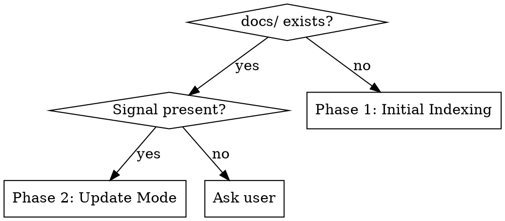

# Codebase Indexer

Scan a project once, write five lean doc files to `docs/`, and read them every future session instead of re-scanning the whole codebase. After each feature or bugfix, update only what changed.

## Mode Detection



**Phase 2 signals:** user says "update docs", "re-index", "update", or just finished a feature/bugfix.

**Ambiguous:** Ask — "Initial index found. Re-index from scratch, or update from recent changes?"

## Session Discipline: Docs First, Code Second

⚠️ **The entire point of this skill is to generate `docs/` files that you READ every session instead of re-scanning the codebase.**

### In Every Project Using Codebase Indexer

1. **Session Start**
   - Read `docs/architecture.md` and `docs/implementation.md` first
   - These files contain the project map — do not re-scan the codebase from scratch

2. **Red Flags — Don't Do These**
   - ❌ Use Glob/Grep to explore or understand project structure
   - ❌ Run broad file searches to learn how things work
   - ❌ Search the codebase when a doc exists that explains it
   - ❌ Use codebase-indexer skill unless maintaining docs after changes

3. **Do This Instead**
   - ✓ Check the docs first before jumping into code exploration
   - ✓ Use targeted Glob/Grep ONLY to find specific files (e.g., you know the filename pattern)
   - ✓ Update docs after every feature/bugfix so future sessions can use them
   - ✓ Ask "Is this in the docs already?" before searching

### Template for CLAUDE.md

Add this section to every project's CLAUDE.md:

```markdown
### ⚠️ Red Flags — Don't Do These

Before searching the codebase, ask: **"Is this information in the docs already?"**

DON'T:
- Use Glob/Grep to explore or understand project structure
- Run broad file searches to learn how things work
- Search the codebase when a doc exists that explains it
- Use codebase-indexer skill unless maintaining docs after changes

DO:
- Start every session reading `docs/architecture.md` and `docs/implementation.md`
- Use targeted Glob/Grep ONLY to find specific files (e.g., you know the filename pattern)
- Check the docs first before jumping into code exploration
- Update docs after every feature/bugfix so future sessions can use them
```

## Execution

| Mode | Read this guide |
|------|----------------|
| No `docs/` folder | Read `guides/initial-scan.md` and follow it |
| Update after changes | Read `guides/update-mode.md` and follow it |

Both guides reference templates in `templates/` — read those when generating or updating doc files.

## File Map

```
~/.claude/skills/codebase-indexer/
  SKILL.md                        ← you are here
  guides/
    initial-scan.md               ← Phase 1: full scan steps
    update-mode.md                ← Phase 2: diff-based update steps
    gitignore-rules.md            ← .gitignore handling
  templates/
    architecture.md               ← template for docs/architecture.md
    implementation.md             ← template for docs/implementation.md
    patterns.md                   ← template for docs/patterns.md
    decisions.md                  ← template for docs/decisions.md
    changelog.md                  ← template for docs/changelog.md
```

## Common Mistakes

| Mistake | Fix |
|---|---|
| Re-scanning the full codebase in Update Mode | Use `git diff HEAD~1 --name-only` to scope the scan |
| Duplicating `.gitignore` entry | Always read first, append only if absent |
| Rewriting whole doc files on update | Edit only the sections corresponding to changed modules |
| Adding ADR for every change | Gate on "was this an architectural decision?" — most changes are not |
| Scanning `node_modules`, `target/`, `dist/` | Exclude build artifacts from all globs |
| Inventing details not found in scan | Say "not determinable from scan" rather than guessing |
